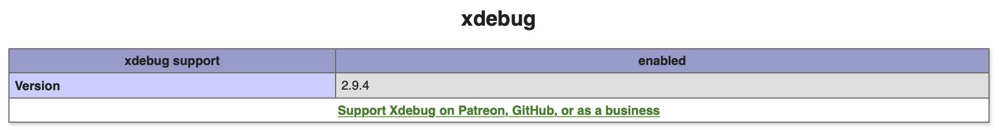

# PHP-Debug Multiple Virtual Hosts On Apache Server (Mac OS, VSCode)

This Repository provides a tutorial to successfully set up IP-based virtual hosts on a local Apache-Server. It shows all necessary steps to create Virtual Hosts and to connect selected local domains to a PHP-Debugging Extension (XDebug).
I highly recommend you to get familiar with all files stored in this repository. You will find examples that clarify the setup process and make it more applicable for your particular use-case.

## 1. Preparation

The following steps are required before working through the provided tutorial.

### 1.1. Install Homebrew

Homebrew is a package manager for mac users that will simplify the setup process significantly.
Install Homebrew by copying this into terminal:

```
/bin/bash -c "$(curl -fsSL https://raw.githubusercontent.com/Homebrew/install/master/install.sh)"
```

For further information see: https://brew.sh/.

### 1.2. Install Apache HTTP Server

In order to locally host websites a HTTP Server installation is needed on your machine.
Check if Apache is already installed by copying this into terminal:

```
httpd -v
```

This should yield something like:

```
Server version: Apache/2.4.41 (Unix)
Server built:   Feb 29 2020 02:40:57
```

If Apache is not present on your machine or you want to install the server manually, check out https://httpd.apache.org/.

### 1.3. Install PHP using Homebrew

Even though macOS is equiped with a fully working PHP version - from own experiences - I don't recommend modifying the symlinks and directory structure if you are not completely aware what the modified files are for.
Homebrew automatically manages the installation of additional PHP versions and PHP extensions like XDebug.
To install the latest version of PHP run the following command in the terminal:

```
brew install php
```

You can also force homebrew to install certain PHP versions (e.g. v. 7.2) by adding additional information to the command:

```
brew install php@7.2
```

Annotation: Only PHP versions > 7.2 are officialy supported by homebrew.

### 1.4. Install XDebug

Xdebug is an extension for PHP to assist with debugging and development.
See https://xdebug.org/ for further information and an installation-guide.

## 2. Create IP-Based Virtual Hosts

If you have finished the preparation steps, you can process by setting up the virtual hosts.
XDebug uses the IP adress to connect the httpd server and the IDE you would like to debug with.
This process is illustrated here:


In order to debug several projects that get hosted locally with different domain-names (eg. exampledomain1.local, exampledomain2.local, ...) any name-based virtual hosts other than localhost will not connect to XDebug. Therefore it is necessary to initialize and assign seperate IP Adresses to each local-domain.

### 2.1. Initialize IP-Adresses

By default the Apache localhost is accessible under the IP 127.0.0.1. You will find this configuration in the directory /etc/hosts.
To add other IP Adresses you need to call:

```
sudo nano /etc/hosts
```

and add other entrys in the following way.

```
##
# Host Database
#
# localhost is used to configure the loopback interface
# when the system is booting.  Do not change this entry.
##
127.0.0.1	localhost
127.0.0.2	examplehost1.local
127.0.0.3	examplehost2.local
127.0.0.4	examplehost3.local
255.255.255.255	broadcasthost
```

In order to also make these IP-Adresses accessible to your Internet browser you need to run:

```
sudo ifconfig lo0 alias 127.0.0.2 up
sudo ifconfig lo0 alias 127.0.0.3 up
sudo ifconfig lo0 alias 127.0.0.4 up
```

This configuration will work only as long as your computer is up and running. As soon as you reboot your mac, this setting will be gone.
To permanently run other IP-Adresses you need to create a .plist file that gets called when booting your computer.
This is done by executing the following command for each local domain you want to initialize (replace examplehost\* with your domain-name).

```
sudo nano /Library/LaunchDaemons/examplehost*.local.plist
```

You need to insert the following lines into the file and save after adapting the IP and the domain name to your use-case.

```
<?xml version="1.0" encoding="UTF-8"?>
<!DOCTYPE plist PUBLIC "-//Apple Computer//DTD PLIST 1.0//EN" "http://www.apple.com/DTDs/PropertyList-1.0.dtd">
<plist version="1.0">
<dict>
    <key>Label</key>
    <string>exampledomain*.local</string>
    <key>RunAtLoad</key>
    <true/>
    <key>ProgramArguments</key>
    <array>
      <string>/sbin/ifconfig</string>
      <string>lo0</string>
      <string>alias</string>
      <string>127.0.0.*</string>
    </array>
</dict>
</plist>
```

### 2.2. Create \*.conf - files

After setting up the additional IP-addresses you are now ready connect these to your local domain.
To do this I recommend creating a directory called "vhosts":

```
sudo mkdir /etc/apache2/vhosts
```

After this you can add config-files for each local domain that you want to host (Replace examplehost with your domain name):

```
sudo nano /etc/apache2/vhosts/examplehost.conf
```

And then add the following code snippet into the \*.conf-file:
Make sure to adapt IP-address, DocumentRoot, Directory and Log-commands.
You need to include the options provided in the Directory-tag in order to grant access to the files stored in your chosen directory.

```
<VirtualHost 127.0.0.*:80>
        DocumentRoot /Users/[username]/Sites/examplehost

        <Directory /Users/[username]/Sites/examplehost>
                Options Indexes FollowSymLinks MultiViews
                AllowOverride All
                Order allow,deny
                allow from all
                Require all granted
        </Directory>

        ServerName examplehost.local
        ServerAlias www.examplehost.local
        ErrorLog /Users/[username]/Sites/examplehost/_logs/error_log
        CustomLog /Users/[username]/Sites/examplehost/_logs/access_log common
</VirtualHost>
```

### 2.3. Include \*.conf - files in Apache httpd.conf

Finally you need to connect the locally configured domains to the apache server by including the host-configuration data files in 'httpd.conf'
Under the tag '# Virtual hosts' please modify the file in the following way:

```
# Virtual hosts
# Include /private/etc/apache2/extra/httpd-vhosts.conf
Include /private/etc/apache2/vhosts/*.conf
```

After that you need to reboot your computer. Then the domain should be accessible in your default browser when inserting [exampledomain1].local

## 3. Connect Virtual Hosts To XDebug and VSCode

To locally debug your php-code using XDebug some final steps are needed to connect Apache, XDebug and your development IDE (i.e. VSCode).

In order to do this you need to edit the "php.ini" file of the homebrew-installed php version that is found under:

```
/usr/local/etc/php/X.X/php.ini
```

where X.X represents the specific php-version number (i.e. 7.4). This file needs to be modified by adding the following paragraph in the end. Make sure to adapt the properties to your specific use case (IDE, ...).

```
[XDebug]
; XDebug Configuration (Attached Manually After Succesfully Installing XDebug)

zend_extension="/usr/local/lib/php/pecl/20190902/xdebug.so"
; Annotation: Path To Xdebug Installation Might Vary Depending On Installation Type And MacOS-Configuration (In This Case: XDebug Installed With Homebrew)

xdebug.remote_enable=1
xdebug.remote_autostart=1
xdebug.remote_connect_back=1
xdebug.remote_handler=dbgp
xdebug.remote_mode=req
xdebug.remote_port=9000
xdebug.idekey=VSCODE
```

Finally, install the VSCode addition "PHP Debug" by Felix Becker. 
https://github.com/felixfbecker/vscode-php-debug

## 4. Verify Installation

After that create a file with the following content in your base-web-projects directory (i.e. /Users/[username]/Sites) with the following content: 

```
<?php 
phpinfo(); 
?>
```
Depending on your configuration, when accessing http://localhost/phpinfo.php there should be a field that displays the XDebug properties. If this field is visible, your installation was successful. 



